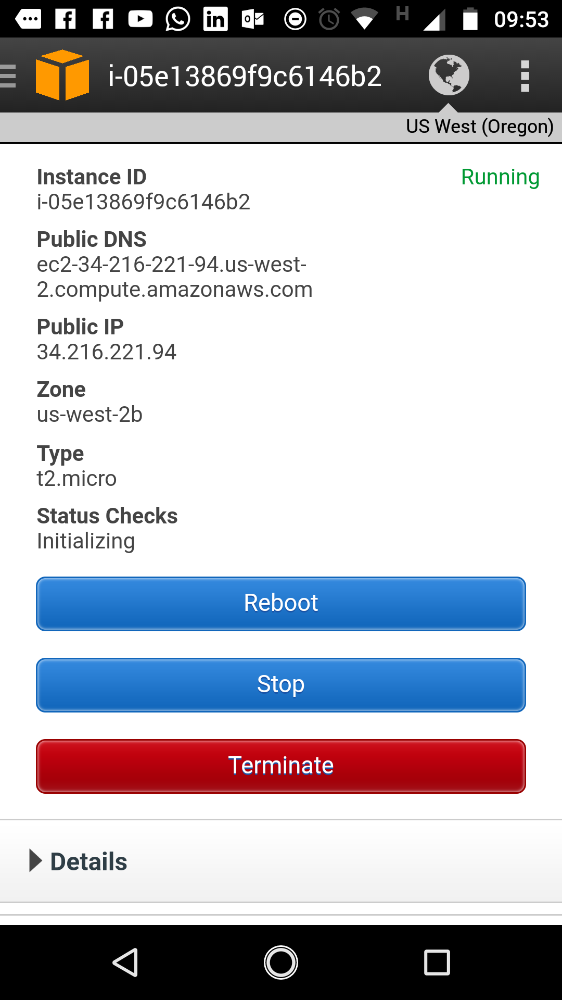

# AWS {data-background=#9292e8}

## Amazon Web Services {width=6%} 

<p, align="justify">
A [Amazon Web Services](https://aws.amazon.com/pt/) (AWS) é uma plataforma de serviços em nuvem segura, oferecendo **poder computacional**, **armazenamento** de banco de dados, distribuição de conteúdo e outras funcionalidades.
</p>

## Abrir uma conta
<h4>Opção gratuíta para 12 meses</h4>

- Nível gratuíto: https://aws.amazon.com/pt/free/
- Siga as instruções online para abertura de conta.
- Parte do procedimento de cadastro envolve uma chamada telefônica e a digitação de um **PIN** usando o teclado do telefone.

## Amazon EC2

[](https://aws.amazon.com/pt/ec2/)

# Configuração da máquina {data-background=#9292e8}

## Escolher uma máquina


## Escolher o tipo de máquina


## Detalhes na configuração


## Detalhes avançados

```
#!/bin/bash

#install R
sudo amazon-linux-extras install R3.4

#install RStudio-Server (2018-07-19)
sudo wget https://download2.rstudio.org/rstudio-server-rhel-1.1.456-x86_64.rpm
sudo yum install -y --nogpgcheck rstudio-server-rhel-1.1.456-x86_64.rpm
sudo rm rstudio-server-rhel-1.1.456-x86_64.rpm

#install Shiny and Shiny-Server (2018-07-19)
sudo -i R -e "install.packages(c('shiny', 'rmarkdown', 'plumber'), repos = 'https://cran.fiocruz.br/')"
sudo wget https://download3.rstudio.org/centos6.3/x86_64/shiny-server-1.5.7.907-rh6-x86_64.rpm
sudo yum install -y --nogpgcheck shiny-server-1.5.7.907-rh6-x86_64.rpm
sudo rm shiny-server-1.5.7.907-rh6-x86_64.rpm

#add user(s)
useradd usuário
echo usuário:senha | chpasswd

#permission to folder
sudo chmod 777 /srv/shiny-server
```
## Armazenamento


## Controle de tráfego na máquina
<h4>Portas de acesso</h4>


## Criação de uma chave para conexão segura


## Máquina funcionando

**Em Public DNS (IPv4)** está o endereço de acesso à máquina. O usuário é o **ec2-user**.


## Acessando a máquina através do **git-bash**

```
ssh ec2-user@ec2-34-219-66-250.us-west-2.compute.amazonaws.com -i thop.pem
```


##


## Informações e controle da máquina pelo celular

<center>
{width=30%}&ensp;
[{width=15%}](https://play.google.com/store/apps/details?id=com.amazon.aws.console.mobile)
</center>

# R, <br> RStudio Server e <br> Shiny Server {data-background=#9292e8}

## RStudio e Shiny Server

- Para acessar o RStudio Server no browser:

```
http://ec2-54-202-207-158.us-west-2.compute.amazonaws.com:8787
```

- Para acessar o Shiny Server:

```
http://ec2-54-202-207-158.us-west-2.compute.amazonaws.com:3838
```

- Para acessar uma aplicação específica:

```
http://ec2-54-202-207-158.us-west-2.compute.amazonaws.com:3838/sample-apps/hello/
```
# Plumber {data-background=#9292e8}

## Configurações necessárias

- Verificar as portas em funcionamento na máquina:

```
netstat -ant
```

- Colocar a porta de acesso à API: `:8000`

## Criando uma API 

Arquivo plumber.R

```{r eval=FALSE}
#' Return the sum of two numbers
#' @param a The first number to add
#' @param b The second number to add
#' @get /sum
#' @html
function(a, b){
  paste("<html><h1>=", as.numeric(a) + as.numeric(b), "<html><h1>")
}
```

Baixar arquivo **plumber.R** na máquina

```
wget https://gist.githubusercontent.com/th1460/5651ece3822f958c018150db6506b1f4/raw/e47b27570a2a04c74192d177f500d3040db05d75/plumber.R
```
Inicializar a API no terminal

```
R -e 'pr <- plumber::plumb("plumber.R"); pr$run(host = "0.0.0.0", port = 8000)'
```
## Acessando a API

Digitando no browser o **host** a **porta** e os **argumentos** de acesso à API:

```
http://ec2-54-200-63-187.us-west-2.compute.amazonaws.com:8000/sum?a=145&b=189
```


## {data-background=#000000}

<p align="center">
[<font color="white">th1460.github.io</font>](https://th1460.github.io)
</p>

